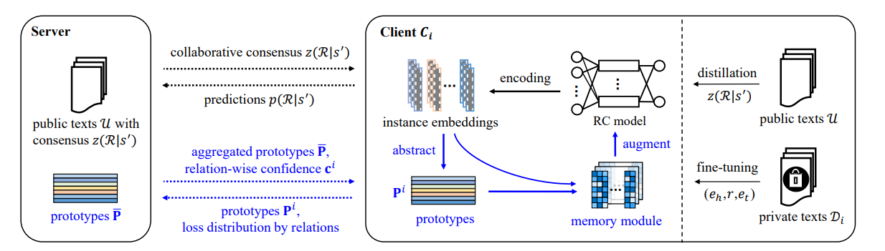

# pf-RC: Personalized Federated Relation Classification over Heterogeneous Texts

## Notice:
***Since we plan to extend our paper into a journal version, we will update the code in a near future.***

Our paper is published at the SIGIR'23 conference, which is available [here](https://dl.acm.org/doi/pdf/10.1145/3539618.3591748). 

## Dependencies
> python 3.6  
> torch > 1.2.0  
> numpy  
> sklearn
> 

## Usage

1. Hyper-parameters: All arguments are setted in the file argument.py. 
   
2. Dataset: At present, we provide the data partition of SemEval, TACRED and TACREDV with `$\beta \in \{1, 5, 100\}$`.

If you want run experiments on different datasets or with different non-IID data, please modify the hyperparameters in argument.py.


## run pf-RC with heterogeneous local models: 
> python train.py --personal True 

## run pf-RC with homogeneous local models: 
> python train.py --personal False

## Citation
If you find our work useful, please kindly cite our paper:

```
@inproceedings{DBLP:conf/sigir/PangZZWX23,
  author       = {Ning Pang and
                  Xiang Zhao and
                  Weixin Zeng and
                  Ji Wang and
                  Weidong Xiao},
  editor       = {Hsin{-}Hsi Chen and
                  Wei{-}Jou (Edward) Duh and
                  Hen{-}Hsen Huang and
                  Makoto P. Kato and
                  Josiane Mothe and
                  Barbara Poblete},
  title        = {Personalized Federated Relation Classification over Heterogeneous
                  Texts},
  booktitle    = {Proceedings of the 46th International {ACM} {SIGIR} Conference on
                  Research and Development in Information Retrieval, {SIGIR} 2023, Taipei,
                  Taiwan, July 23-27, 2023},
  pages        = {973--982},
  publisher    = {{ACM}},
  year         = {2023},
  url          = {https://doi.org/10.1145/3539618.3591748},
  doi          = {10.1145/3539618.3591748},
  timestamp    = {Mon, 24 Jul 2023 23:34:31 +0200},
  biburl       = {https://dblp.org/rec/conf/sigir/PangZZWX23.bib},
  bibsource    = {dblp computer science bibliography, https://dblp.org}
}
```
